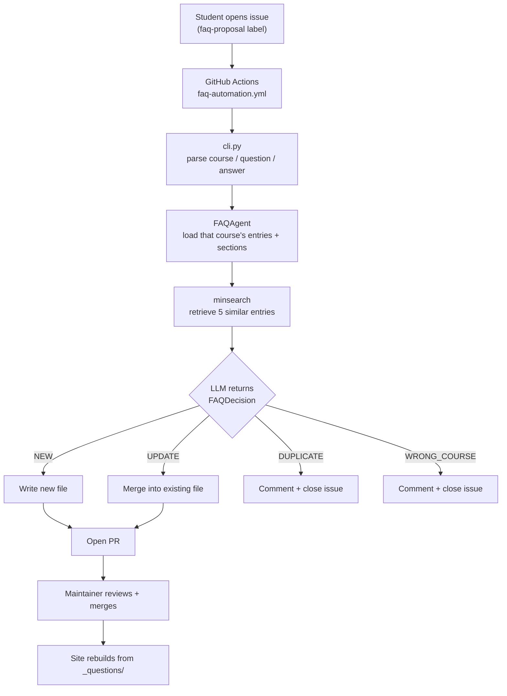

# DataTalks.Club FAQ

Answers to the questions DataTalks.Club Zoomcamp students actually ask, so they
can find one in seconds instead of scrolling Slack. Read it at
[datatalks.club/faq](https://datatalks.club/faq).

Each cohort brings thousands of students through the same material, so they hit
the same walls:

- a Docker mount that fails on one OS
- an API that changed since the video was recorded
- a homework answer that doesn't match any of the options

Someone already solved each of these in Slack. But Slack scrolls and the next
cohort asks again, while course repos hold the material rather than the failure
modes. So instructors answer the same question every cohort, and students search
a chat history they weren't around for.

## The parts

The FAQ is more than a folder of answers, and five pieces keep it useful:

| Part | What it does |
|---|---|
| Content (`_questions/`) | 1378 answers across 6 courses, one markdown file each |
| FAQ agent (`faq_automation/`) | Turns a student's GitHub issue into a reviewed PR, or closes it |
| Evals (`faq_automation/evals/`) | Measure the agent, so a prompt or model change is a decision and not a guess |
| Skills (`.claude/skills/`) | Drive the jobs a human still does: adding entries, reviewing PRs, mining Slack |
| Site generator (`website/`) | Publishes the answers twice: HTML for students, JSON for programs |

And one that lives elsewhere: the
[FAQ assistant](https://github.com/DataTalksClub/faq-assistant) is a Slack bot
that answers students directly, using this content as its corpus.

## Content

Every answer is one markdown file under `_questions/<course>/<section>/`, with an
id, the question, and a sort order in its frontmatter. Sections and their order
come from each course's `_metadata.yaml`.

Each section there also has a `comment` describing what it owns. Those comments
are written for the agent as much as for people. The agent weights them above
search results when it picks where an entry goes, so it guesses at any section
that lacks one.

Open a [FAQ proposal issue](https://github.com/DataTalksClub/faq/issues/new/choose)
to add an answer, or edit `_questions/` directly and send a PR. See
[CONTRIBUTING.md](CONTRIBUTING.md) for the format.

## FAQ agent

A knowledge base only stays useful when adding to it stays cheap. Asking a
maintainer to file every recurring question by hand isn't cheap, so a bot does
the filing.

A student who has hit a problem and solved it opens a GitHub issue from the FAQ
proposal template. They pick a course, then write up the question and answer.

GitHub Actions runs the agent, which decides one of four things:

- the question is new, so it opens a PR adding an entry to the right section
- it adds to an existing entry, so it opens a PR merging the two
- it's already answered, so it comments with a link and closes the issue
- it's about a different course, so it comments and closes the issue

A maintainer reviews every PR before anything reaches the site.



The agent doesn't pick the course. It comes from the dropdown the student chose,
and `cli.py` passes it straight through as the directory the agent loads. The
agent only ever sees one course's entries and section metadata, so it can't
compare against another course, because it never sees one. That's the whole
reason `WRONG_COURSE` exists. Without it, a proposal filed against the wrong
course gets forced into whichever section of that course fits least badly.

Retrieval is keyword search
([`minsearch`](https://github.com/alexeygrigorev/minsearch)) over the selected
course, and the top 5 hits go into the prompt as context. The LLM then makes one
structured call that returns the action, target section, sort order, and
rewritten content together as a single `FAQDecision`.

Sort-order collisions get resolved after the decision rather than by the model.
`actions.py` shifts existing entries down to make room, so the model picking an
occupied slot isn't a failure mode.

## Evals

We run two suites because retrieval and model decisions fail in different ways:

- The search eval runs 25 difficult queries without an LLM. If it can't find an
  existing FAQ, the model can't recognize the proposal as a duplicate. The
  current recall@5 is 0.840.
- The end-to-end eval runs 61 proposals through search and the model. It checks
  the action, section, generated answer, and filename metadata.

We add cases when a reviewer finds a mistake that could happen again. See the
[eval guide](faq_automation/evals/README.md) for the datasets, metrics, and
commands.

## Skills

The agent handles the filing, but people still add entries by hand, review the
PRs, and go looking for questions the FAQ is missing. Those jobs live in
`.claude/skills/` so they run the same way every time.

- `add-faq-record` adds or updates a single entry from a question, a chat thread,
  or a screenshot, and pushes back when unclear course material caused the
  confusion, because fixing that material beats writing an FAQ around it.
- `clear-backlog` resolves open FAQ PRs first and then issues, one item at a time.
  It checks placement, duplicates, and canonical sources before reviewing
  content quality. It recommends eval coverage only for meaningful agent
  regressions.
- `slack-faq-fetch` pulls recent Slack discussion for a course into a review
  export, to find the questions nobody has filed yet.

## Site generator

We render the site with our own generator (`website/generate_website.py`) rather
than Jekyll or another off-the-shelf tool, and dbt is the reason. A good chunk of
the Data Engineering answers contain dbt code.

dbt writes its refs in Jinja braces:

```sql
select * from {{ ref('stg_trips') }}
```

Jekyll renders through Liquid, which claims those same braces, so every dbt
answer then needs escaping. An author who forgets breaks the build or silently
loses the snippet. The escaping also ends up in the source file, where the next
person copies it. Fighting the templating on every dbt entry turned out to be
more work than writing the generator, so we wrote the generator.

The generator reads every markdown file under `_questions/` and parses the
frontmatter. It orders sections per `_metadata.yaml` and questions by
`sort_order`. Then it writes the same content twice, once for people and once for
programs.

Students read the HTML, which is one page per course plus an index. We convert
the markdown through Pygments for syntax highlighting and render it into the
Jinja2 templates in `_layouts/`. Question ids become the anchors, so an entry
keeps its URL when it moves between sections.

Programs read the JSON, which holds the same answers without the presentation.
`json/courses.json` indexes the courses.

Each `json/<course>.json` is a flat list of entries:

```json
{
  "id": "74eb249bbf",
  "course": "llm-zoomcamp",
  "section": "General Course-Related Questions",
  "question": "I just discovered the course. Can I still join?",
  "answer": "Yes, but if you want to receive a certificate, you need to submit your project while we're still accepting submissions."
}
```

The FAQ agent in this repo doesn't use that feed, because it runs inside the repo
and reads `_questions/` straight from disk. Other things do, and the closest one
is a course. LLM Zoomcamp students fetch `json/courses.json` in the first lesson
and index it to build their own RAG pipeline. We teach retrieval over the FAQ
that the retrieval bot answers from.

Their first lesson opens with this:

```python
import requests

docs_url = "https://datatalks.club/faq/json/courses.json"
response = requests.get(docs_url)
courses_raw = response.json()
```

## FAQ assistant

Students who ask in Slack rather than opening the site get answered by the
[FAQ assistant](https://github.com/DataTalksClub/faq-assistant). It's a separate
Slack bot that reads this content as one of its sources.

It runs as a single AWS Lambda with a prebuilt keyword index baked into the
deployment package. There's no vector database and effectively no fixed cost.
Course channels search that course's FAQ plus the course material, and other
channels search the general [docs](https://github.com/DataTalksClub/docs) corpus.

So an answer written here does double duty. It's on the site for anyone who
looks, and it's in the bot's index for anyone who asks.

## Running it yourself

You need Python 3.13 and [uv](https://docs.astral.sh/uv/). An OpenAI API key is
only needed for the agent and the evals, so the site builds without one.

```bash
git clone https://github.com/DataTalksClub/faq
cd faq
uv sync --dev

make website
make test
```

`make website` builds the static site into `_site/`, and `make test` runs the 102
website tests and 75 automation tests, none of which need an API key or a
service.

To drive the agent locally, set a key and feed it an issue body.

```bash
export OPENAI_API_KEY='...'

cat > test_issue.txt << 'EOF'
### Course
machine-learning-zoomcamp

### Question
How do I check my Python version?

### Answer
Run `python --version` in your terminal.
EOF

uv run python -m faq_automation.cli \
  --issue-body "$(cat test_issue.txt)" \
  --issue-number 42
```

The key can also live in `.env`. The model comes from `DEFAULT_MODEL` in
`faq_automation/rag_agent.py`, and `FAQ_MODEL=gpt-5.6-luna` overrides it for one
run.

## Running the evals

The evals need `OPENAI_API_KEY`, and cases run on the flex tier, which bills at
the Batch API rate but answers in real time.

```bash
uv run --project faq_automation python -m faq_automation.evals.runner

uv run --project faq_automation python -m faq_automation.evals.runner --case 303

uv run --project faq_automation python -m faq_automation.evals.runner --batch

uv run --project faq_automation python -m faq_automation.evals.probe_wrong_course gpt-5.4-nano 5
```

The first command runs every case. `--case` runs one `case_id`, where a positive
number is a GitHub issue and a negative one is a synthetic case, so pass those as
`--case=-3`. `--batch` sends the suite as one Batch API job for the same price,
though it can take hours to come back. The last command re-runs the wrong-course
cases 5 times each to measure recall and false positives.

## Fetching FAQ candidates from Slack

Maintainers can pull recent Slack activity into review files, then read through
them for questions the FAQ is missing.

```bash
cp .env.example .env
uv run python -m faq_automation.slack_fetch
uv run python -m faq_automation.slack_fetch --course data-engineering-zoomcamp
```

Set `SLACK_BOT_TOKEN` in `.env` before the first run. By default this reads
`_questions/llm-zoomcamp/_metadata.yaml`, fetches the Slack channel named in its
`slack_channel` field, checks the last 7 days, and writes JSON and Markdown
exports to `.tmp/`. Use `--channel` only to override the metadata for one run.
The bot token lives in your [Slack app](https://api.slack.com/apps) under OAuth
and Permissions, as the Bot User OAuth Token starting with `xoxb-`.

## Layout of the repo

The content, the agent, and the site generator each live in their own tree.

```text
faq/
├── _questions/<course>/         # the content: one markdown file per answer
│   ├── _metadata.yaml           # section ids, names, and placement comments
│   └── <section>/NNN_<id>_<slug>.md
├── faq_automation/              # the agent
│   ├── rag_agent.py             # prompt, FAQDecision schema, DEFAULT_MODEL
│   ├── cli.py                   # issue body in, decision JSON out
│   ├── actions.py               # writes files, builds PR bodies and comments
│   ├── core.py                  # frontmatter, metadata, sort order
│   ├── slack_fetch.py           # pulls candidate questions from Slack
│   └── evals/                   # see evals/README.md
│       ├── cases.py             # 61 end-to-end cases + check predicates
│       ├── runner.py            # scores cases (flex tier by default)
│       ├── flex.py / batch.py   # the two discounted OpenAI tiers
│       └── probe_wrong_course.py # repeat-runs to measure decision stability
├── website/                     # the static site generator
├── _layouts/  assets/           # Jinja2 templates and CSS
├── .claude/skills/              # add-faq-record, clear-backlog, slack-faq-fetch
└── docs/model-choice.md         # why gpt-5.4-nano
```

## Design decisions

We use keyword search (`minsearch`) rather than a vector database. The index
holds a few hundred entries per course and gets rebuilt from disk on each run. It
has to work in a GitHub Actions job with no services. Embeddings would retrieve
paraphrases better, and the challenge set's 0.840 recall@5 is what that costs us.
It isn't enough to justify an external service in the path of a bot that runs a
few times a week.

The course comes from the student rather than the model. A dropdown is one click
and is right most of the time. Making it a model decision would put a much
larger, more expensive classification in front of every proposal, all to fix a
minority case. `WRONG_COURSE` handles that minority instead.

We run `gpt-5.4-nano`, chosen on failure cost rather than eval score. Three
models scored within one case of each other. We picked the one least likely to
rewrite a good entry or close a valid proposal. The full reasoning and the case
against it are in [docs/model-choice.md](docs/model-choice.md).

Evals run on the flex tier, which costs the same as the Batch API but answers in
real time. A batch run of this suite sat at 0/51 completed for 2.7 hours, which
is fine for CI and useless for iterating. `--batch` is still there for when
nothing is waiting.

Every content change goes through a PR, and the bot never commits to `main`. It
can close an issue on its own. That's why the evals care much more about wrongly
closing an issue than wrongly opening a PR.

## Continuous integration

| Workflow | Trigger | What it does |
|---|---|---|
| `test-website.yml` | PRs and pushes touching the site | Runs the website test suite |
| `test-faq-automation.yml` | PRs and pushes touching the bot | Runs the automation test suite |
| `faq-automation.yml` | Issue opened with the `faq-proposal` label | Runs the agent, then opens a PR or closes the issue |
| `build-website.yml` | Push to `main` | Rebuilds and deploys to GitHub Pages |

The evals don't run in CI. They cost money and move around enough that a single
run would produce flaky failures, as the
[eval README](faq_automation/evals/README.md) covers. Run them by hand when
changing the prompt, the model, or the search index.

## Limitations

The agent has four known weak spots, plus one thing it doesn't do at all.

- The agent isn't deterministic near its decision boundaries. The same proposal
  can come back as `NEW` on one run and `WRONG_COURSE` on the next. On
  `gpt-5-nano`, 5 of 7 wrong-course eval cases flipped on identical input. One
  eval run isn't evidence, which is why `probe_wrong_course.py` exists.
- Wrong-course detection catches roughly 1 in 5 misfiled proposals, a deliberate
  trade covered in [docs/model-choice.md](docs/model-choice.md).
- Each course describes its sections to a different standard, and the agent leans
  on those descriptions to place an entry. It reads the `comment` field in
  `_metadata.yaml` and weights it above retrieval, so it guesses at any section
  that lacks one. ML Zoomcamp now describes 12 of 18 sections and LLM Zoomcamp 12
  of 16, leaving the homework sections as the main gap.
- Retrieval is keyword-based, so a proposal that paraphrases an existing entry
  without sharing its vocabulary can get filed as new.
- Nothing monitors the agent. We only see how well it decides when we run the
  evals or review a PR, and nothing records what it decides in production over
  time.
