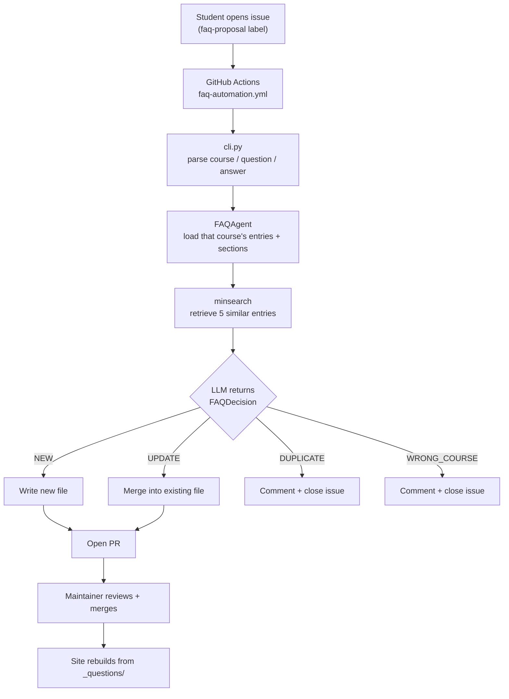

# DataTalks.Club FAQ

A searchable FAQ for the DataTalks.Club Zoomcamps, plus a bot that turns student
questions into FAQ entries. Students hit the same problems every cohort, and the
answers used to scatter across Slack threads that scroll away. This collects them
in one place and keeps collecting them without a maintainer filing each one.

Read it at [datatalks.club/faq](https://datatalks.club/faq).

## Contents

Jump to whichever part you need.

- [The same questions every cohort](#the-same-questions-every-cohort)
- [The bot's four decisions](#the-bots-four-decisions)
- [Contributing an FAQ entry](#contributing-an-faq-entry)
- [Eval results](#eval-results)
- [Running it yourself](#running-it-yourself)
- [Running the evals](#running-the-evals)
- [Fetching FAQ candidates from Slack](#fetching-faq-candidates-from-slack)
- [From issue to pull request](#from-issue-to-pull-request)
- [Building the site](#building-the-site)
- [Layout of the repo](#layout-of-the-repo)
- [Design decisions](#design-decisions)
- [Continuous integration](#continuous-integration)
- [Limitations](#limitations)

## The same questions every cohort

Each Zoomcamp cohort brings thousands of students through the same material, so
they hit the same walls:

- a Docker mount that fails on one OS
- an API that changed since the video was recorded
- a homework answer that doesn't match any of the options

The answers exist, because someone already solved it in Slack. But Slack scrolls
and the next cohort asks again, while course repos hold the material rather than
the failure modes. Instructors end up answering the same question every cohort,
and students end up searching a chat history they weren't around for.

This repo keeps those answers: 1378 of them across 6 courses, published as a
static searchable site. The bot exists because a knowledge base only stays useful when adding to it
stays cheap. Asking a maintainer to file every recurring question by hand isn't
cheap.

## The bot's four decisions

A student who has hit a problem and solved it opens a GitHub issue from the FAQ
proposal template. They pick a course, then write up the question and answer.

The bot then decides one of four things:

- the question is new, so it opens a PR adding an entry to the right course section
- it adds something to an existing entry, so it opens a PR merging the two
- it's already answered, so it comments with a link and closes the issue
- it's about a different course, so it comments and closes the issue

A maintainer reviews every PR before anything reaches the site. See
[from issue to pull request](#from-issue-to-pull-request) for what
happens in between.

## Contributing an FAQ entry

Open a [FAQ proposal issue](https://github.com/DataTalksClub/faq/issues/new/choose),
or edit `_questions/` directly and send a PR. See
[CONTRIBUTING.md](CONTRIBUTING.md) for the file format and section conventions.

## Eval results

Two eval suites cover the bot, because it has two layers that fail differently.

| Suite | What it covers | Cases | Runtime | Current |
|---|---|---|---|---|
| `run_search_eval.py` | Retrieval only, no LLM calls | 67 | ~4s | recall@5 0.830, MRR@5 0.816 |
| `runner.py` | Full pipeline, search to written entry | 54 | ~2 min | 37/54 on `gpt-5.4-nano` |

The search eval pairs each real student question with the entry it became, and
measures whether keyword search surfaces that entry. This is what drives
duplicate detection. If recall drops, genuine duplicates get filed again as new
entries.

The end-to-end eval runs each real proposal through the whole bot and checks it
against what a human decided. It looks for the right action, the right section,
runnable code, and no sort-order collision.

Neither number is the interesting one, because the bot's failures don't cost the
same. Opening a bad PR costs a maintainer the review they were doing anyway.
Closing a valid proposal with a wrong explanation reaches a student, and nobody
reviews a closed issue. Both suites are weighted to catch the second kind, and `gpt-5.4-nano`
was chosen for that reason rather than for its score. [docs/model-choice.md](docs/model-choice.md) walks
through that tradeoff, including the model that beat it on two headline numbers
and why we passed on it.

The eval cases come from PR reviews. When a human corrects the bot and the
mistake looks like something that will recur, it becomes a permanent regression
test. See the [eval README](faq_automation/evals/README.md) for that loop, the
tags, and how to add cases.

Tests need no API key and no services:

```bash
make test
```

That runs 102 website tests and 75 automation tests.

## Running it yourself

You need Python 3.13 and [uv](https://docs.astral.sh/uv/). An OpenAI API key is
only needed for the bot and the evals, so the site builds without one.

```bash
git clone https://github.com/DataTalksClub/faq
cd faq
uv sync --dev

make website
make test
```

`make website` builds the static site into `_site/`, and `make test` runs
everything that doesn't need an API key. To drive the bot locally, set a key and
feed it an issue body.

```bash
export OPENAI_API_KEY='...'

cat > test_issue.txt << 'EOF'
### Course
machine-learning-zoomcamp

### Question
How do I check my Python version?

### Answer
Run `python --version` in your terminal.
EOF

uv run python -m faq_automation.cli \
  --issue-body "$(cat test_issue.txt)" \
  --issue-number 42
```

The key can also live in `.env`. The model comes from `DEFAULT_MODEL` in
`faq_automation/rag_agent.py`, and `FAQ_MODEL=gpt-5.6-luna` overrides it for one
run.

## Running the evals

The evals need `OPENAI_API_KEY`, and cases run on the flex tier, which bills at
the Batch API rate but answers in real time.

```bash
uv run --project faq_automation python -m faq_automation.evals.runner

uv run --project faq_automation python -m faq_automation.evals.runner --case 303

uv run --project faq_automation python -m faq_automation.evals.runner --batch

uv run --project faq_automation python -m faq_automation.evals.probe_wrong_course gpt-5.4-nano 5
```

The first command runs every case. `--case` runs one `case_id`, where a positive
number is a GitHub issue and a negative one is a synthetic case, so pass those as
`--case=-3`. `--batch` sends the suite as one Batch API job for the same price,
though it can take hours to come back. The last command re-runs the wrong-course
cases 5 times each to measure recall and false positives.

## Fetching FAQ candidates from Slack

Maintainers can pull recent Slack activity into review files, then read through
them for questions the FAQ is missing.

```bash
cp .env.example .env
uv run python -m faq_automation.slack_fetch
uv run python -m faq_automation.slack_fetch --course data-engineering-zoomcamp
```

Set `SLACK_BOT_TOKEN` in `.env` before the first run. By default this reads
`_questions/llm-zoomcamp/_metadata.yaml`, fetches the Slack channel named in its
`slack_channel` field, checks the last 7 days, and writes JSON and Markdown
exports to `.tmp/`. Use `--channel` only to override the metadata for one run.
The bot token lives in your [Slack app](https://api.slack.com/apps) under OAuth
and Permissions, as the Bot User OAuth Token starting with `xoxb-`.

## From issue to pull request

One issue moves through parsing, retrieval, and one LLM call before a human sees it.



The agent doesn't pick the course. It comes from the dropdown the student chose,
and `cli.py` passes it straight through as the directory the agent loads. The
agent only ever sees one course's entries and section metadata, so it can't
compare against another course, because it never sees one. That's the whole
reason `WRONG_COURSE` exists. Without it, a proposal filed against the wrong
course gets forced into whichever section of that course fits least badly.

Retrieval is keyword search (`minsearch`) over the selected course, and the top 5
hits go into the prompt as context. The LLM then makes one structured call that
returns the action, target section, sort order, and rewritten content together as
a single `FAQDecision`.

Sort-order collisions get resolved after the decision rather than by the model.
`actions.py` shifts existing entries down to make room, so the model picking an
occupied slot isn't a failure mode.

## Building the site

`collect_questions()` reads every markdown file under `_questions/`, parses the
YAML frontmatter, and loads course metadata for ordering. `process_markdown()`
turns markdown into HTML, highlights syntax with Pygments, auto-links URLs, and
fills in image placeholders. `sort_sections_and_questions()` orders sections per
`_metadata.yaml` and questions by `sort_order`. `generate_site()` renders the
Jinja2 templates into course pages and an index, then copies assets into `_site/`.

## Layout of the repo

The content, the bot, and the site generator each live in their own tree.

```text
faq/
├── _questions/<course>/         # the content: one markdown file per answer
│   ├── _metadata.yaml           # section ids, names, and placement comments
│   └── <section>/NNN_<id>_<slug>.md
├── faq_automation/              # the bot
│   ├── rag_agent.py             # prompt, FAQDecision schema, DEFAULT_MODEL
│   ├── cli.py                   # issue body in, decision JSON out
│   ├── actions.py               # writes files, builds PR bodies and comments
│   ├── core.py                  # frontmatter, metadata, sort order
│   ├── slack_fetch.py           # pulls candidate questions from Slack
│   └── evals/                   # see evals/README.md
│       ├── cases.py             # 54 end-to-end cases + check predicates
│       ├── runner.py            # scores cases (flex tier by default)
│       ├── flex.py / batch.py   # the two discounted OpenAI tiers
│       └── probe_wrong_course.py # repeat-runs to measure decision stability
├── website/                     # the static site generator
├── _layouts/  assets/           # Jinja2 templates and CSS
└── docs/model-choice.md         # why gpt-5.4-nano
```

## Design decisions

We use keyword search (`minsearch`) rather than a vector database. The index holds a few hundred entries per course and gets rebuilt from disk on
each run. It has to work in a GitHub Actions job with no services. Embeddings
would retrieve paraphrases better, and the search eval's 0.830 recall@5 is what
that costs us. It isn't enough to justify an external service in the path of a
bot that runs a few times a week.

The course comes from the student rather than the model. A dropdown is one click
and is right most of the time. Making it a model decision would put a much
larger, more expensive classification in front of every proposal, all to fix a
minority case. `WRONG_COURSE` handles that minority instead.

We run `gpt-5.4-nano`, chosen on failure cost rather than eval score. Three models scored within one case of each
other. We picked the one least likely to rewrite a good entry or close a valid
proposal. The full reasoning and the case
against it are in [docs/model-choice.md](docs/model-choice.md).

Evals run on the flex tier, which costs the same as the Batch API but answers in
real time. A batch run of this suite sat at 0/51 completed for 2.7 hours, which
is fine for CI and useless for iterating. `--batch` is still there for when
nothing is waiting.

Every content change goes through a PR, and the bot never commits to `main`. It
can close an issue on its own. That's why the evals care much more about wrongly
closing an issue than wrongly opening a PR.

## Continuous integration

| Workflow | Trigger | What it does |
|---|---|---|
| `test-website.yml` | PRs and pushes touching the site | Runs the website test suite |
| `test-faq-automation.yml` | PRs and pushes touching the bot | Runs the automation test suite |
| `faq-automation.yml` | Issue opened with the `faq-proposal` label | Runs the agent, then opens a PR or closes the issue |
| `build-website.yml` | Push to `main` | Rebuilds and deploys to GitHub Pages |

The evals don't run in CI. They cost money and move around enough that a single
run would produce flaky failures, as the
[eval README](faq_automation/evals/README.md) covers. Run them by hand when
changing the prompt, the model, or the search index.

## Limitations

The bot has four known weak spots, plus one thing it doesn't do at all.

- The agent isn't deterministic near its decision boundaries. The same proposal
  can come back as `NEW` on one run and `WRONG_COURSE` on the next. On
  `gpt-5-nano`, 5 of 7 wrong-course eval cases flipped on identical input. One
  eval run isn't evidence, which is why `probe_wrong_course.py` exists.
- Wrong-course detection catches roughly 1 in 5 misfiled proposals, a deliberate
  trade covered in [docs/model-choice.md](docs/model-choice.md).
- Each course describes its sections to a different standard, and the agent
  leans on those descriptions to place an entry. It reads the `comment` field in
  `_metadata.yaml` and weights it above retrieval, so it guesses at any section
  that lacks one. ML Zoomcamp now describes 12 of 18 sections and LLM Zoomcamp 12
  of 16, leaving the homework sections as the main gap.
- Retrieval is keyword-based, so a proposal that paraphrases an existing entry
  without sharing its vocabulary can get filed as new.
- Nothing monitors the bot. We only see how well it decides when we run the evals
  or review a PR, and nothing records what it decides in production over time.
