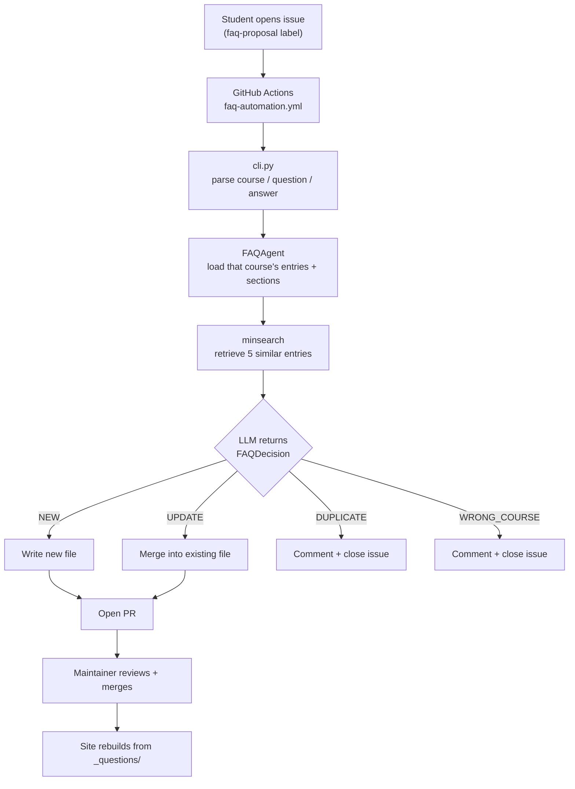

# DataTalks.Club FAQ

A static site generator for DataTalks.Club course FAQs with automated AI-powered FAQ maintenance.

## Features

- **Static Site Generation**: Converts markdown FAQs to a beautiful, searchable HTML site
- **Automated FAQ Management**: AI-powered bot that processes new FAQ proposals
- **Intelligent Triage**: Decides whether a proposal becomes a new entry, updates an existing one, duplicates one, or was filed against the wrong course
- **GitHub Integration**: Seamless workflow via GitHub Issues and Pull Requests

## Project Structure

```
faq/
├── _questions/              # FAQ content organized by course
│   ├── machine-learning-zoomcamp/
│   │   ├── _metadata.yaml   # Course configuration
│   │   ├── general/         # General course questions
│   │   ├── module-1/        # Module-specific questions
│   │   └── ...
│   ├── data-engineering-zoomcamp/
│   └── ...
├── _layouts/                # Jinja2 HTML templates
│   ├── base.html
│   ├── course.html
│   └── index.html
├── assets/                  # CSS and static assets
├── faq_automation/          # FAQ automation module
│   ├── core.py             # Core FAQ processing functions
│   ├── rag_agent.py        # AI-powered decision agent
│   ├── actions.py          # GitHub Actions integration
│   └── cli.py              # Command-line interface
├── tests/                   # Test suite
├── generate_website.py      # Main site generator
└── Makefile                # Build commands
```

## Contributing FAQ Entries

See [CONTRIBUTING.md](CONTRIBUTING.md) for detailed instructions.


## Development

### Setup

```bash
# Install dependencies
uv sync --dev
```

For testing the FAQ automation locally, you'll need to set your OpenAI API key:

```bash
export OPENAI_API_KEY='your-api-key-here'
```

Or add it to your shell configuration file (e.g., `~/.bashrc`, `~/.zshrc`).

### Running Locally

To test the FAQ automation locally, create a `test_issue.txt` file:

```bash
cat > test_issue.txt << 'EOF'
### Course
machine-learning-zoomcamp

### Question
How do I check my Python version?

### Answer
Run `python --version` in your terminal.
EOF
```

Then process the FAQ proposal:

```bash
uv run python -m faq_automation.cli \
  --issue-body "$(cat test_issue.txt)" \
  --issue-number 42
```

### Fetching FAQ Candidates From Slack

Maintainers can pull recent Slack activity into local review files:

```bash
cp .env.example .env
# Edit .env and set SLACK_BOT_TOKEN

uv run python -m faq_automation.slack_fetch
```

By default this reads `_questions/llm-zoomcamp/_metadata.yaml`, fetches Slack channel `course-llm-zoomcamp`, checks the last 7 days, and writes JSON and Markdown exports to `.tmp/`. To fetch another course, pass its course directory name:

```bash
uv run python -m faq_automation.slack_fetch --course data-engineering-zoomcamp
```

Each course metadata file has a `slack_channel` field. Use `--channel another-channel` only when you need to override the metadata for one run. Ask Codex to review the generated export, identify missing FAQs for that course, and add the approved ones.

Find the Slack bot token in your Slack app at <https://api.slack.com/apps> under OAuth & Permissions. Use the Bot User OAuth Token value, which starts with `xoxb-`.

### Testing

```bash
# Generate static website
make website

# Run all tests
make test

# Run unit tests only
make test-unit

# Run integration tests only
make test-int
```

Run the FAQ agent's RAG eval suite (requires `OPENAI_API_KEY`). Cases run on the
flex tier, which bills at the Batch API rate but answers in real time:

```bash
# Run every eval case
uv run --project faq_automation python -m faq_automation.evals.runner

# Run only cases originating from one GitHub issue
uv run --project faq_automation python -m faq_automation.evals.runner --issue 303

# Submit the suite as one Batch API job instead (same price, no waiting on it)
uv run --project faq_automation python -m faq_automation.evals.runner --batch
```

See the [FAQ automation eval documentation](faq_automation/evals/README.md) for details.

See [testing documentation](tests/README.md) for detailed information about the test suite, including how to run specific test files or methods, test coverage details, and guidelines for adding new tests.

## Architecture

### FAQ Automation Pipeline

A student proposes an FAQ by opening a GitHub issue from the proposal template,
which asks for a course, a question, and an answer. Everything after that runs
without a human until a decision is made.



The course is not something the agent decides. It comes from the dropdown the
student picked, and `cli.py` passes it straight through as the directory the
agent loads. The agent therefore only ever sees one course's entries and section
metadata — it cannot compare against another course, because it never sees one.
That is the entire reason `WRONG_COURSE` exists: without it, a proposal filed
against the wrong course gets forced into whichever section of that course fits
least badly.

Retrieval is keyword search (`minsearch`) over the selected course, and the top
5 hits go into the prompt as context. The LLM then makes one structured call
that returns the action, the target section, the sort order, and the rewritten
content together as a single `FAQDecision`.

The four actions split into two very different paths, and the difference is what
drives the eval strategy:

| Action | What happens | Human in the loop? |
|---|---|---|
| `NEW` / `UPDATE` | Writes the file, opens a PR | Yes — nothing lands unreviewed |
| `DUPLICATE` / `WRONG_COURSE` | Comments and closes the issue | No |

A bad `NEW` costs a maintainer one PR review, which was going to happen anyway. A
bad `DUPLICATE` or `WRONG_COURSE` closes a student's contribution with an
incorrect explanation, and nobody reviews a closed issue. The
[eval suite](faq_automation/evals/README.md) is weighted accordingly: it guards
much harder against wrongly closing an issue than against wrongly opening a PR.

Sort order collisions are handled after the decision, not by the model —
`actions.py` shifts existing entries down to make room, so the model picking an
occupied slot is not a failure mode.

### Site Generation Pipeline

1. **Collection** (`collect_questions()`):
   - Reads all markdown files from `_questions/`
   - Parses YAML frontmatter
   - Loads course metadata for section ordering

2. **Processing** (`process_markdown()`):
   - Converts markdown to HTML
   - Applies syntax highlighting (Pygments)
   - Auto-links plain text URLs
   - Handles image placeholders

3. **Sorting** (`sort_sections_and_questions()`):
   - Orders sections per `_metadata.yaml`
   - Sorts questions by `sort_order` field

4. **Rendering** (`generate_site()`):
   - Applies Jinja2 templates
   - Generates course pages and index
   - Copies assets to `_site/`
