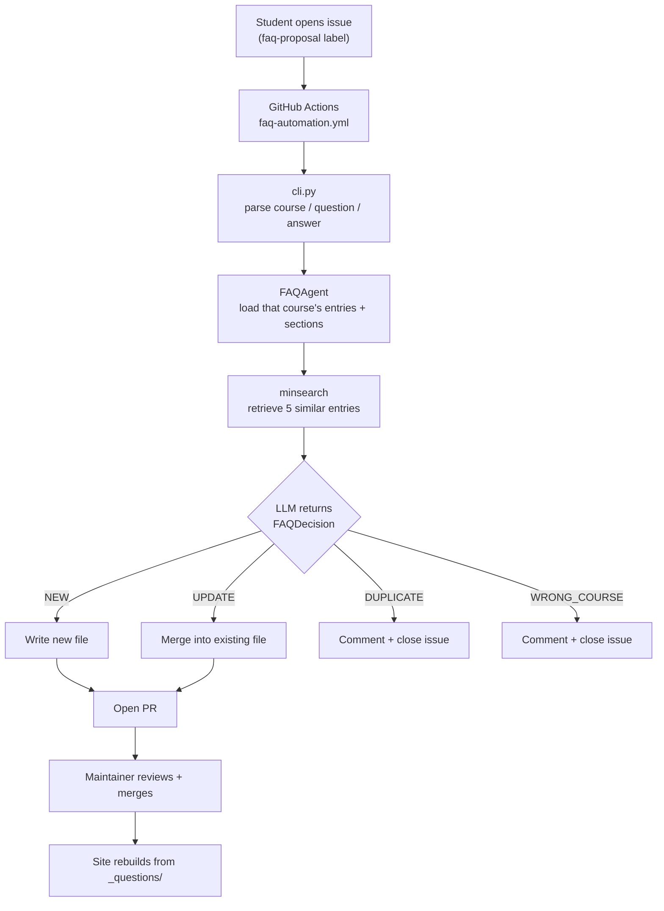

# DataTalks.Club FAQ

A searchable FAQ for the DataTalks.Club Zoomcamps, plus a bot that turns student
questions into FAQ entries. Students hit the same problems every cohort, and the
answers were scattered across Slack threads that scroll away — this collects them
in one place and keeps collecting them without a maintainer doing it by hand.

**Live site: <https://datatalks.club/faq>**

## Contents

- [The problem](#the-problem)
- [How it works](#how-it-works)
- [Contributing an FAQ entry](#contributing-an-faq-entry)
- [Does it work?](#does-it-work)
- [Running it yourself](#running-it-yourself)
- [Architecture](#architecture)
- [Design decisions](#design-decisions)
- [CI/CD](#cicd)
- [Limitations](#limitations)

## The problem

Each Zoomcamp cohort brings thousands of students through the same material, and
they hit the same walls: a Docker mount that fails on one OS, an API that changed
since the video was recorded, a homework answer that doesn't match any option.

The answers exist — someone already solved it in Slack. But Slack scrolls, and
the next cohort asks again. Course repos hold the material, not the failure modes.
The result is instructors answering the same question every cohort, and students
searching a chat history they weren't around for.

This repo is the durable layer: 1378 answers across 6 courses, published as a
static searchable site. The bot exists because a knowledge base only stays useful
if adding to it is cheap, and asking a maintainer to hand-file every recurring
question is not cheap.

## How it works

A student who has hit — and solved — a problem opens a GitHub issue from the FAQ
proposal template, picking a course and writing the question and answer. From
there the bot decides one of four things:

- **It's new** → opens a PR adding the entry to the right course section
- **It adds to an existing entry** → opens a PR merging it in
- **It's already answered** → comments with a link and closes the issue
- **It's about a different course** → comments and closes the issue

A maintainer reviews every PR before anything reaches the site. See
[Architecture](#architecture) for what happens between the issue and the PR.

## Contributing an FAQ entry

Open a [FAQ proposal issue](https://github.com/DataTalksClub/faq/issues/new/choose),
or edit `_questions/` directly and send a PR. See [CONTRIBUTING.md](CONTRIBUTING.md)
for the file format and section conventions.

## Does it work?

Two eval suites, because the bot has two layers that fail differently.

**Retrieval** (`run_search_eval.py`, 67 cases, ~4s, no LLM calls). Each case is a
real student question paired with the entry it became; the eval measures whether
keyword search surfaces that entry. This is what drives duplicate detection — if
recall is low, genuine duplicates get filed again as new entries. Baseline:
recall@5 = 0.830, MRR@5 = 0.777.

**End-to-end** (`runner.py`, 51 cases, ~2 min). Each case is a real proposal run
through the full pipeline and checked against what a human decided: the right
action, the right section, runnable code, no sort-order collision. Currently
36/51 on `gpt-5.4-nano`.

Neither number is the interesting one. The bot's failures are not equally
expensive: opening a bad PR costs a maintainer the review they were doing anyway,
while closing a valid proposal with a wrong explanation reaches a student and
nobody reviews it. So the suites are weighted to catch the second kind, and
`gpt-5.4-nano` was chosen for the same reason rather than for its score. That
tradeoff — including the model that beat it on two headline numbers and why we
passed — is written up in **[docs/model-choice.md](docs/model-choice.md)**.

The eval cases come from PR reviews. When a human corrects the bot and the
mistake looks like a pattern rather than a one-off, it becomes a permanent
regression test. See [the eval README](faq_automation/evals/README.md) for the
loop, the tags, and how to add cases.

**Tests:** 102 website tests and 49 automation tests, no API key or services
needed.

```bash
make test
```

## Running it yourself

Prerequisites: Python 3.13 and [uv](https://docs.astral.sh/uv/). An OpenAI API
key is needed only for the bot and the evals — the site builds without one.

```bash
git clone https://github.com/DataTalksClub/faq
cd faq
uv sync --dev

make website     # builds the static site into _site/
make test        # runs everything that doesn't need an API key
```

To exercise the bot locally, set a key and feed it an issue body:

```bash
export OPENAI_API_KEY='...'      # or put it in .env

cat > test_issue.txt << 'EOF'
### Course
machine-learning-zoomcamp

### Question
How do I check my Python version?

### Answer
Run `python --version` in your terminal.
EOF

uv run python -m faq_automation.cli \
  --issue-body "$(cat test_issue.txt)" \
  --issue-number 42
```

The model comes from `DEFAULT_MODEL` in `faq_automation/rag_agent.py`; override
it for one run with `FAQ_MODEL=gpt-5.6-luna`.

### Running the evals

Requires `OPENAI_API_KEY`. Cases run on the flex tier, which bills at the Batch
API rate but answers in real time.

```bash
# Every case
uv run --project faq_automation python -m faq_automation.evals.runner

# Only cases from one GitHub issue
uv run --project faq_automation python -m faq_automation.evals.runner --issue 303

# One Batch API job instead — same price, but can take hours to come back
uv run --project faq_automation python -m faq_automation.evals.runner --batch

# Wrong-course recall and false positives, 5 repeats per case
uv run --project faq_automation python -m faq_automation.evals.probe_wrong_course gpt-5.4-nano 5
```

### Fetching FAQ candidates from Slack

Maintainers can pull recent Slack activity into local review files:

```bash
cp .env.example .env             # then set SLACK_BOT_TOKEN
uv run python -m faq_automation.slack_fetch
uv run python -m faq_automation.slack_fetch --course data-engineering-zoomcamp
```

By default this reads `_questions/llm-zoomcamp/_metadata.yaml`, fetches the Slack
channel named in its `slack_channel` field, checks the last 7 days, and writes
JSON and Markdown exports to `.tmp/`. Use `--channel` only to override the
metadata for one run. Find the bot token at <https://api.slack.com/apps> under
OAuth & Permissions — the Bot User OAuth Token, starting with `xoxb-`.

## Architecture

### FAQ automation pipeline



The course is not something the agent decides. It comes from the dropdown the
student picked, and `cli.py` passes it straight through as the directory the
agent loads. The agent therefore only ever sees one course's entries and section
metadata — it cannot compare against another course, because it never sees one.
That is the entire reason `WRONG_COURSE` exists: without it, a proposal filed
against the wrong course gets forced into whichever section of that course fits
least badly.

Retrieval is keyword search (`minsearch`) over the selected course, and the top 5
hits go into the prompt as context. The LLM then makes one structured call
returning the action, target section, sort order, and rewritten content together
as a single `FAQDecision`.

Sort-order collisions are resolved after the decision, not by the model —
`actions.py` shifts existing entries down to make room, so the model picking an
occupied slot is not a failure mode.

### Site generation pipeline

1. **Collection** (`collect_questions()`) — reads every markdown file under
   `_questions/`, parses YAML frontmatter, loads course metadata for ordering
2. **Processing** (`process_markdown()`) — markdown to HTML, syntax highlighting
   via Pygments, auto-linked URLs, image placeholders
3. **Sorting** (`sort_sections_and_questions()`) — sections per `_metadata.yaml`,
   questions by `sort_order`
4. **Rendering** (`generate_site()`) — Jinja2 templates to course pages and index,
   assets copied into `_site/`

### Project structure

```
faq/
├── _questions/<course>/         # the content: one markdown file per answer
│   ├── _metadata.yaml           # section ids, names, and placement comments
│   └── <section>/NNN_<id>_<slug>.md
├── faq_automation/              # the bot
│   ├── rag_agent.py             # prompt, FAQDecision schema, DEFAULT_MODEL
│   ├── cli.py                   # issue body in, decision JSON out
│   ├── actions.py               # writes files, builds PR bodies and comments
│   ├── core.py                  # frontmatter, metadata, sort order
│   ├── slack_fetch.py           # pulls candidate questions from Slack
│   └── evals/                   # see evals/README.md
│       ├── cases.py             # 51 end-to-end cases + check predicates
│       ├── runner.py            # scores cases (flex tier by default)
│       ├── flex.py / batch.py   # the two discounted OpenAI tiers
│       └── probe_wrong_course.py # repeat-runs to measure decision stability
├── website/                     # the static site generator
├── _layouts/  assets/           # Jinja2 templates and CSS
└── docs/model-choice.md         # why gpt-5.4-nano
```

## Design decisions

**Keyword search (`minsearch`), not a vector database.** The index is a few
hundred entries per course, rebuilt from disk on each run, and it has to work in
a GitHub Actions job with no services. Embeddings would retrieve paraphrases
better — the search eval's 0.830 recall@5 is the cost — but not enough to justify
an external service in the critical path of a bot that runs a few times a week.

**The course comes from the student, not the model.** A dropdown is one click and
is right most of the time. Making it a model decision would put a much larger,
more expensive classification in front of every proposal to fix a minority case.
`WRONG_COURSE` handles the minority instead.

**`gpt-5.4-nano`.** Chosen on failure cost rather than eval score: three models
scored within one case of each other, so we picked the one least likely to rewrite
a good entry or close a valid proposal. Full reasoning and the case against in
[docs/model-choice.md](docs/model-choice.md).

**Flex tier for evals.** Same price as the Batch API, but real time. A batch run
of this suite sat at 0/51 completed for 2.7 hours — fine for CI, useless for
iterating. `--batch` is still there for when nothing is waiting.

**Every content change goes through a PR.** The bot never commits to `main`. It
can close an issue on its own, which is why the evals care much more about
wrongful closes than wrongful PRs.

## CI/CD

| Workflow | Trigger | What it does |
|---|---|---|
| `test-website.yml` | PRs and pushes touching the site | Runs the website test suite |
| `test-faq-automation.yml` | PRs and pushes touching the bot | Runs the automation test suite |
| `faq-automation.yml` | Issue opened with the `faq-proposal` label | Runs the agent; opens a PR or closes the issue |
| `build-website.yml` | Push to `main` | Rebuilds and deploys to GitHub Pages |

The evals are not in CI. They cost money and are non-deterministic enough that a
single run would produce flaky failures — see
[the eval README](faq_automation/evals/README.md). Run them by hand when changing
the prompt, the model, or the search index.

## Limitations

- **The agent is non-deterministic near its decision boundaries.** The same
  proposal can come back `NEW` on one run and `WRONG_COURSE` on the next; on
  `gpt-5-nano` 5 of 7 wrong-course eval cases flipped on identical input. A single
  eval run is not evidence, which is why `probe_wrong_course.py` exists.
- **Wrong-course detection catches roughly 1 in 5 misfiled proposals.** A
  deliberate trade — see [docs/model-choice.md](docs/model-choice.md).
- **Section metadata quality varies by course, and it drives placement.** ML
  Zoomcamp describes 5 of 18 sections; LLM Zoomcamp describes 12 of 16. The bot
  places worst where the metadata says least, and its `misc` section has drifted
  into a 40-entry catch-all.
- **Retrieval is keyword-based**, so a proposal that paraphrases an existing entry
  without sharing its vocabulary can be filed as new.
- **No monitoring.** Decision quality is known only from eval runs and PR review;
  nothing tracks what the bot decides in production over time.
